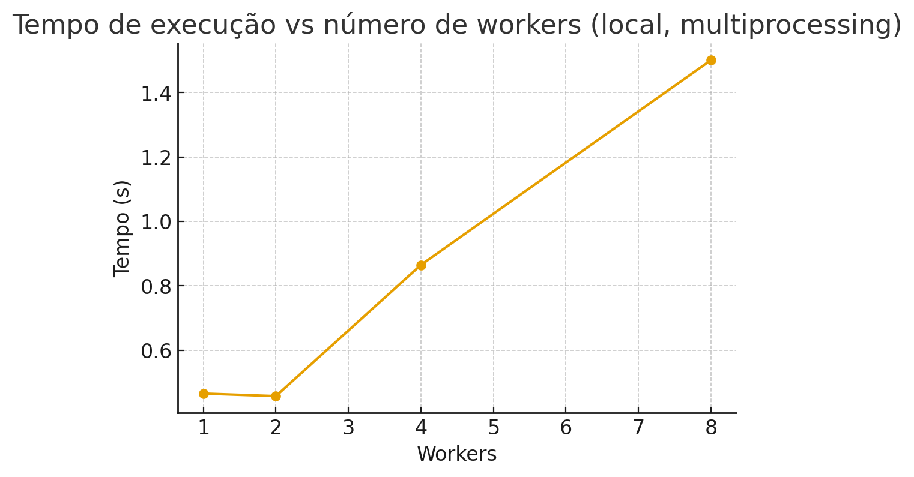

# RELATÓRIO — Projeto HPC: Estimativa de π por Monte Carlo

## 1. Resumo
Projeto que implementa uma prova de conceito de paralelismo para um problema massivo (Monte Carlo).

## 2. Problema e relevância
Estimar π por simulação é um benchmark clássico para medir overheads de paralelismo e I/O mínimo.

## 3. Arquitetura e paralelismo
- Implementação principal em Python.
- Suporte a MPI via mpi4py (execução em cluster com mpirun/srun).
- Fallback local com multiprocessing para testes rápidos.

## 4. Metodologia de experimentos
- Variação do número de processos/workers (1,2,4,8,...)
- Métricas: tempo total, speedup, eficiência, estimativa de π.

## 5. Resultados (exemplo)

A tabela abaixo mostra o tempo de execução, speedup e eficiência para diferentes números de workers.  
Os dados foram obtidos a partir do arquivo `results/projeto_hpc_speedup.csv`.

| Workers | Pontos  | Tempo (s) | Estimativa π | Speedup | Eficiência |
|---------|---------|-----------|--------------|---------|------------|
| 1       | 400000  | 0.466     | 3.14126      | 1.00    | 1.00       |
| 2       | 400000  | 0.458     | 3.14089      | 1.02    | 0.51       |
| 4       | 400000  | 0.865     | 3.13786      | 0.54    | 0.13       |
| 8       | 400000  | 1.500     | 3.14027      | 0.31    | 0.04       |

Também foi gerado o gráfico abaixo:

## 6. Limitações e próximos passos
- Python puro tem overhead; para escala real use C/OpenMP ou vetorização (NumPy) e MPI C/C++.

## 7. Como rodar no Santos Dumont
1. Faça login no nó de acesso.
2. Ajuste `scripts/job_cpu.slurm` para os módulos disponíveis no SD.
3. Submeta: `sbatch scripts/job_cpu.slurm`.

